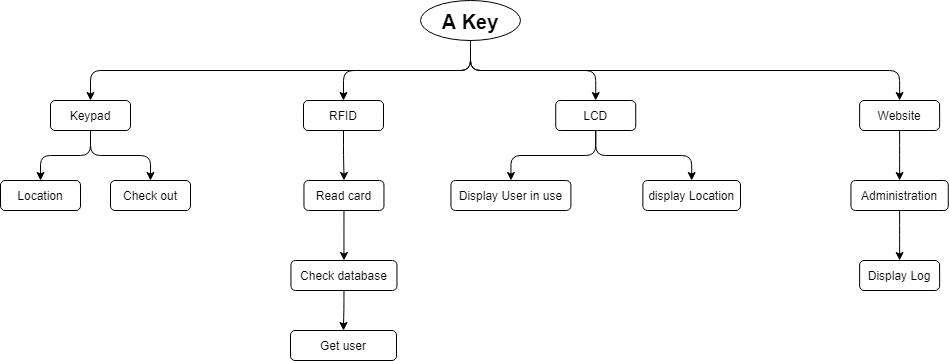
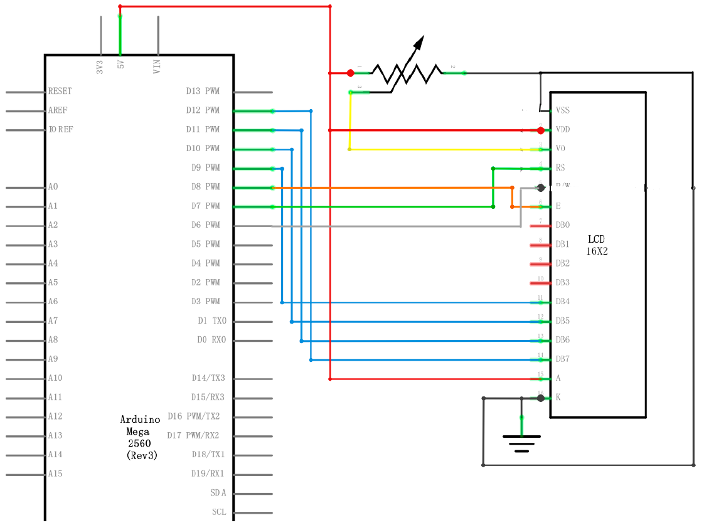
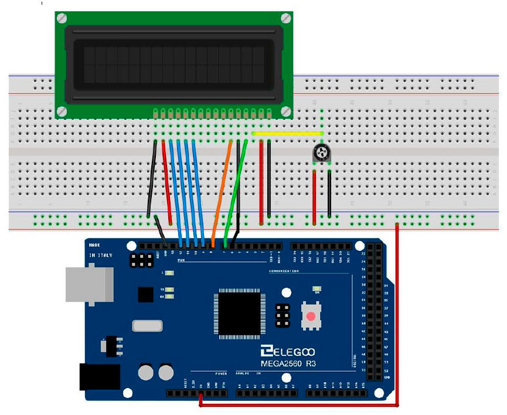

# A Nøgle
***
### Description 

this project is support to help the key system we have in skp about the A(Alternative) key.
since peapol need to register an application form manuelly with paper and pen everytime they 
borrow the key. The object of this system is to make it more autonomous and faster.
so that peapol doen't wast time to write  down the form.
the form contain:

1. the name of the borrower (user).
2. where it will be use (location).
3. at what time it were borrow.
4. then peapol will have to check out when the key is return.

***

### Overview of the project

After some throught of the project.
 
The projekt will be made with an Adruino wish will display  a menu via an LCD with the help of a keypad
peapol will be able to choose the option of the key location.
 
To register the peapol we will use an rfid reader that will be able to r/w  to a database
 
and there will be need of a website for the administration instructor  to check  in case of need. there for we will need some log  in the database

***

### Material

1. LCD display
2. Keypad
3. RFID
4. Adruino mega2560
5. Atmel ice
6. protenciometer
7. database
8. website

***
### Pogram used

- AtmelStudio : c programming for embbeded
- Tera Term   : Console terminal for embbeded testing
- Visualstudio: for fullstack programing

***

### A Key HIPO

***

### Database

***

#### TODO
- [ ] Check if there is any DB or AD that have the card record
- [ ] How to connect to the AD/DB

***

### LCD 

***

##### DATASHEET

https://www.sparkfun.com/datasheets/LCD/HD44780.pdf

##### Usefull information

http://maxembedded.com/2011/06/lcd-interfacing-with-avr/  
this is link referrence will be the closest one to the one we will use on the project with a lcd library, information about installation, and coding sample for our lcd will be here  
 
https://www.electronicwings.com/avr-atmega/lcd16x2-interfacing-with-atmega16-32  
This link is an advance version, with the basic  on how the lcd is build without the library  

#### Interfacing Diagram

This picture is from Ilearn, the pin to the adruino are not like in the picture 

#### Wiring Diagram

This picture is from Ilearn, the pin use in this picture are different from the one we are using take that in mind

#### TODO
- [x] DataSheet
- [x] Interfacing Diagram
- [x] Wiring diagram
- [ ] Documentation

***

### Keypad

***

#### TODO

- [ ] HIPO
- [ ] Flow Shart
- [ ] Make it work with interrupt
- [ ] Return a string instead of a char
- [ ] Display the  menu on keypad click:
    - Lager
    - Faverihallen
    - Oslo
    - X-feldt
    - Møbellageret
    - Madrid
    - Post
    - Andet
- [ ] lock function when key on use

***

### RFID

***

#### TODO

- [ ] Check how is work
- [ ] Test with a skole card
- [ ] HIPO
- [ ] Flow Shart
- [ ] Try to communicate with AD/DB
- [ ] Check database for card
- [ ] Get user name of the card ID code
- [ ] desplay username on the LCD
- [ ] BLock other user to use card while the key is out
- [ ] Unblock when the same card is rescaned

